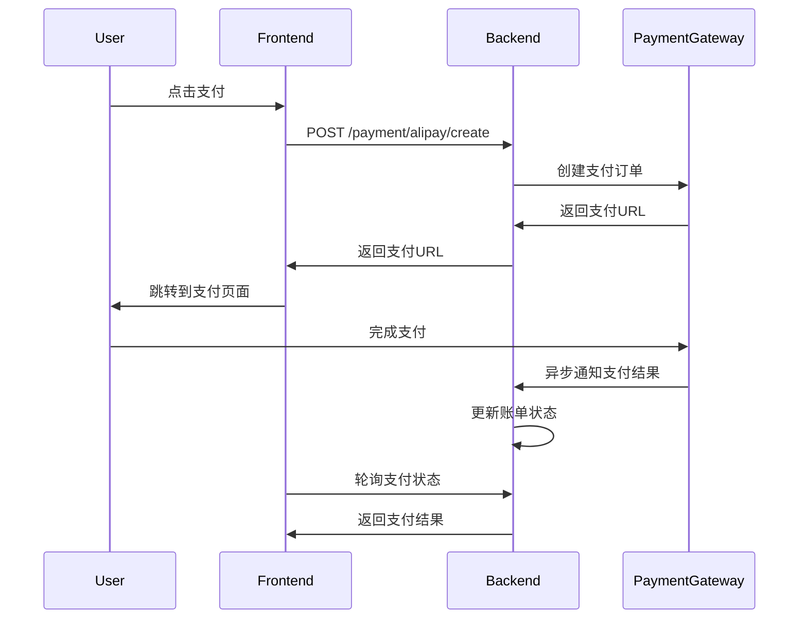

# 支付网关API文档

## 💳 支付网关API

### 基础信息

- **基础URL**: `http://api.happy-community.com/api/v1/payment`
- **认证方式**: JWT Bearer Token
- **数据格式**: JSON

### 通用响应格式

```json
{
  "code": 200,
  "message": "success",
  "data": {
    "pay_url": "https://openapi.alipaydev.com/gateway.do?...",
    "out_trade_no": "ALIPAY202401151230451a2b3c4d",
    "payment_method": "alipay"
  },
  "timestamp": "2024-01-15T12:00:00Z"
}
```

### 通用错误码

- `200`: 成功
- `400`: 请求参数错误
- `401`: 未认证
- `403`: 权限不足
- `404`: 资源不存在
- `500`: 支付网关错误

---

## 🔐 支付宝支付

### 1. 创建支付宝支付订单

```http
POST /payment/alipay/create
Authorization: Bearer {token}
Content-Type: application/json
```

**请求参数**

```json
{
  "bill_id": 123
}
```

**响应数据**

```json
{
  "code": 200,
  "message": "success",
  "data": {
    "pay_url": "https://openapi.alipaydev.com/gateway.do?charset=utf-8&...",
    "out_trade_no": "ALIPAY202401151230451a2b3c4d",
    "payment_method": "alipay",
    "amount": 285.50,
    "subject": "幸福小区-2024年1月物业费"
  }
}
```

### 2. 支付宝异步通知（回调接口）

```http
POST /payment/alipay/notify
Content-Type: application/x-www-form-urlencoded
```

**通知参数（支付宝发送）**

| 参数名 | 类型 | 说明 |
|--------|------|------|
| out_trade_no | String | 商户订单号 |
| trade_no | String | 支付宝交易号 |
| trade_status | String | 交易状态 |
| total_amount | Decimal | 订单金额 |
| seller_id | String | 卖家支付宝用户号 |
| timestamp | String | 通知时间 |

**响应要求**
- 成功处理：返回纯文本 `success`
- 处理失败：返回纯文本 `failure`

---

## 💰 微信支付

### 1. 创建微信支付订单

```http
POST /payment/wxpay/create
Authorization: Bearer {token}
Content-Type: application/json
```

**请求参数**

```json
{
  "bill_id": 123
}
```

**响应数据**

```json
{
  "code": 200,
  "message": "success",
  "data": {
    "pay_url": "weixin://wxpay/bizpayurl?pr=abcdefgh123456",
    "code_url": "weixin://wxpay/bizpayurl?pr=abcdefgh123456",
    "out_trade_no": "WXPAY202401151230451a2b3c4d",
    "payment_method": "wxpay",
    "amount": 28550,
    "description": "幸福小区-2024年1月物业费"
  }
}
```

### 2. 微信支付异步通知（回调接口）

```http
POST /payment/wxpay/notify
Content-Type: application/json
```

**通知参数（微信支付发送）**

```json
{
  "id": "EV-2018022511223320873",
  "create_time": "2015-05-20T13:29:35+08:00",
  "resource_type": "encrypt-resource",
  "event_type": "TRANSACTION.SUCCESS",
  "resource": {
    "algorithm": "AEAD_AES_256_GCM",
    "ciphertext": "...",
    "associated_data": "...",
    "nonce": "..."
  }
}
```

**响应要求**
- 成功处理：返回JSON `{"code": "SUCCESS", "message": "成功"}`
- 处理失败：返回JSON `{"code": "FAIL", "message": "失败原因"}`

---

## 📊 支付状态查询

### 1. 查询支付状态

```http
GET /payment/status/{out_trade_no}
Authorization: Bearer {token}
```

**响应数据**

```json
{
  "code": 200,
  "message": "success",
  "data": {
    "out_trade_no": "ALIPAY202401151230451a2b3c4d",
    "trade_no": "20240115220014000005000000000000",
    "payment_method": "alipay",
    "amount": 285.50,
    "status": "paid",
    "paid_at": "2024-01-15T12:05:23Z",
    "bill_id": 123
  }
}
```

---

## 🔄 支付流程说明

### 完整支付流程

1. **前端** → 用户点击支付按钮
2. **前端** → 调用 `/payment/{gateway}/create` 创建支付订单
3. **后端** → 返回支付网关URL
4. **前端** → 重定向用户到支付网关URL
5. **用户** → 在支付平台完成支付
6. **支付平台** → 异步通知后端支付结果
7. **后端** → 更新账单状态
8. **前端** → 轮询查询支付状态或等待推送通知

### 时序图



---

## 📝 API使用示例

### 前端调用示例（JavaScript）

```javascript
const API_BASE = 'http://api.happy-community.com/api/v1';

// 设置请求头
const getHeaders = () => {
  const token = localStorage.getItem('token');
  return {
    'Content-Type': 'application/json',
    'Authorization': `Bearer ${token}`
  };
};

// 创建支付宝支付
const createAlipayPayment = async (billId) => {
  try {
    const response = await fetch(`${API_BASE}/payment/alipay/create`, {
      method: 'POST',
      headers: getHeaders(),
      body: JSON.stringify({ bill_id: billId })
    });
    
    const result = await response.json();
    
    if (result.code === 200) {
      // 跳转到支付宝支付页面
      window.location.href = result.data.pay_url;
      
      // 或者在新窗口打开
      // window.open(result.data.pay_url, '_blank');
      
      return result.data.out_trade_no;
    } else {
      throw new Error(result.message);
    }
  } catch (error) {
    console.error('创建支付宝支付失败:', error);
    throw error;
  }
};

// 创建微信支付
const createWxpayPayment = async (billId) => {
  try {
    const response = await fetch(`${API_BASE}/payment/wxpay/create`, {
      method: 'POST',
      headers: getHeaders(),
      body: JSON.stringify({ bill_id: billId })
    });
    
    const result = await response.json();
    
    if (result.code === 200) {
      // 微信支付通常返回二维码URL，需要在前端生成二维码
      const qrcodeUrl = result.data.code_url;
      showQRCode(qrcodeUrl); // 自定义显示二维码的函数
      
      return result.data.out_trade_no;
    } else {
      throw new Error(result.message);
    }
  } catch (error) {
    console.error('创建微信支付失败:', error);
    throw error;
  }
};

// 查询支付状态
const checkPaymentStatus = async (outTradeNo) => {
  try {
    const response = await fetch(`${API_BASE}/payment/status/${outTradeNo}`, {
      headers: getHeaders()
    });
    
    const result = await response.json();
    return result.data;
  } catch (error) {
    console.error('查询支付状态失败:', error);
    throw error;
  }
};

// 支付状态轮询
const pollPaymentStatus = (outTradeNo, callback, interval = 3000) => {
  const poll = async () => {
    try {
      const status = await checkPaymentStatus(outTradeNo);
      
      if (status.status === 'paid') {
        callback(true, status);
      } else if (status.status === 'failed') {
        callback(false, status);
      } else {
        // 继续轮询
        setTimeout(poll, interval);
      }
    } catch (error) {
      console.error('轮询支付状态失败:', error);
      setTimeout(poll, interval);
    }
  };
  
  poll();
};

// 使用示例
const handlePayment = async (billId, paymentMethod) => {
  try {
    let outTradeNo;
    
    if (paymentMethod === 'alipay') {
      outTradeNo = await createAlipayPayment(billId);
    } else if (paymentMethod === 'wxpay') {
      outTradeNo = await createWxpayPayment(billId);
    }
    
    // 开始轮询支付状态
    pollPaymentStatus(outTradeNo, (success, status) => {
      if (success) {
        alert('支付成功！');
        // 更新界面状态
        updateBillStatus(billId, 'paid');
      } else {
        alert('支付失败，请重试');
      }
    });
    
  } catch (error) {
    alert(`支付创建失败: ${error.message}`);
  }
};
```

### React组件示例

```jsx
import React, { useState } from 'react';

const PaymentComponent = ({ bill }) => {
  const [loading, setLoading] = useState(false);
  const [paymentUrl, setPaymentUrl] = useState('');
  
  const handleAlipayPayment = async () => {
    setLoading(true);
    try {
      const response = await fetch('/api/v1/payment/alipay/create', {
        method: 'POST',
        headers: {
          'Content-Type': 'application/json',
          'Authorization': `Bearer ${localStorage.getItem('token')}`
        },
        body: JSON.stringify({ bill_id: bill.id })
      });
      
      const result = await response.json();
      
      if (result.code === 200) {
        setPaymentUrl(result.data.pay_url);
        // 跳转到支付页面
        window.location.href = result.data.pay_url;
      } else {
        alert(result.message);
      }
    } catch (error) {
      alert('支付创建失败');
    } finally {
      setLoading(false);
    }
  };
  
  const handleWxpayPayment = async () => {
    setLoading(true);
    try {
      const response = await fetch('/api/v1/payment/wxpay/create', {
        method: 'POST',
        headers: {
          'Content-Type': 'application/json',
          'Authorization': `Bearer ${localStorage.getItem('token')}`
        },
        body: JSON.stringify({ bill_id: bill.id })
      });
      
      const result = await response.json();
      
      if (result.code === 200) {
        // 显示微信支付二维码
        setPaymentUrl(result.data.code_url);
        showWechatQRCode(result.data.code_url);
      } else {
        alert(result.message);
      }
    } catch (error) {
      alert('支付创建失败');
    } finally {
      setLoading(false);
    }
  };
  
  return (
    <div className="payment-component">
      <h3>支付账单: {bill.title}</h3>
      <p>金额: ¥{bill.amount}</p>
      
      <div className="payment-buttons">
        <button 
          onClick={handleAlipayPayment} 
          disabled={loading}
          className="btn-alipay"
        >
          {loading ? '处理中...' : '支付宝支付'}
        </button>
        
        <button 
          onClick={handleWxpayPayment} 
          disabled={loading}
          className="btn-wxpay"
        >
          {loading ? '处理中...' : '微信支付'}
        </button>
      </div>
      
      {paymentUrl && (
        <div className="payment-qrcode">
          
          <p>请使用微信扫描二维码完成支付</p>
        </div>
      )}
    </div>
  );
};

export default PaymentComponent;
```

### Python后端测试示例

```python
import requests
import json

def test_payment_api():
    """测试支付API"""
    base_url = "http://127.0.0.1:5000/api/v1"
    token = "your_jwt_token_here"
    
    headers = {
        "Content-Type": "application/json",
        "Authorization": f"Bearer {token}"
    }
    
    # 测试支付宝支付
    print("测试支付宝支付...")
    alipay_data = {"bill_id": 1}
    
    response = requests.post(
        f"{base_url}/payment/alipay/create",
        headers=headers,
        json=alipay_data
    )
    
    if response.status_code == 200:
        result = response.json()
        print("支付宝支付URL:", result['data']['pay_url'])
        print("商户订单号:", result['data']['out_trade_no'])
    else:
        print("支付宝支付创建失败:", response.text)
    
    # 测试微信支付
    print("\n测试微信支付...")
    wxpay_data = {"bill_id": 1}
    
    response = requests.post(
        f"{base_url}/payment/wxpay/create",
        headers=headers,
        json=wxpay_data
    )
    
    if response.status_code == 200:
        result = response.json()
        print("微信支付二维码URL:", result['data']['code_url'])
        print("商户订单号:", result['data']['out_trade_no'])
    else:
        print("微信支付创建失败:", response.text)

def simulate_alipay_callback():
    """模拟支付宝回调（用于测试）"""
    callback_url = "http://127.0.0.1:5000/api/v1/payment/alipay/notify"
    
    # 模拟支付宝回调数据
    callback_data = {
        "out_trade_no": "ALIPAY202401151230451a2b3c4d",
        "trade_no": "20240115220014000005000000000000",
        "trade_status": "TRADE_SUCCESS",
        "total_amount": "285.50",
        "seller_id": "2088100000000000",
        "timestamp": "2024-01-15 12:05:23"
    }
    
    response = requests.post(callback_url, data=callback_data)
    print("支付宝回调响应:", response.text)

if __name__ == "__main__":
    test_payment_api()
    # simulate_alipay_callback()
```

---

## ⚠️ 注意事项

### 1. 安全要求
- 所有支付请求必须通过HTTPS传输
- 支付回调接口需要验证签名
- 敏感信息（API密钥）必须加密存储

### 2. 环境配置
```python
# 开发环境使用沙箱配置
ALIPAY_APP_ID = "2021000000000000"  # 沙箱APP ID
ALIPAY_GATEWAY = "https://openapi.alipaydev.com/gateway.do"

# 生产环境配置
# ALIPAY_APP_ID = "你的正式APP ID"
# ALIPAY_GATEWAY = "https://openapi.alipay.com/gateway.do"
```

### 3. 错误处理
- 支付创建失败时返回详细错误信息
- 网络超时设置合理的重试机制
- 记录完整的支付日志用于排查问题

### 4. 前端集成建议
- 提供支付方式选择界面
- 显示支付状态加载动画
- 实现支付状态轮询机制
- 处理支付取消和失败情况
