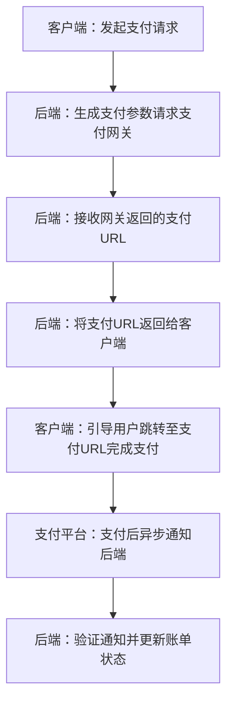

# 支付网关技术实现

## 💳 支付功能集成方案概述

本后端的支付集成的核心流程主要包含以下步骤：
1.  **后端**接收支付请求（如账单ID）
2.  **后端**调用支付平台API生成支付订单并获取支付网关URL
3.  **后端**将该URL返回给**客户端**（如网页、App）
4.  **用户**在支付平台完成支付
5.  **支付平台**通过同步(`return_url`)和异步(`notify_url`)两种方式将支付结果通知到**后端**
6.  **后端**验证通知真实性并更新订单状态

## 🔒 支付安全提醒

集成支付功能时，安全至关重要：

- **密钥管理**：绝对不要将API密钥、商户密钥等敏感信息硬编码在代码中或提交到版本控制系统。务必使用环境变量或安全的配置管理服务。
- **HTTPS**：生产环境必须启用HTTPS，确保支付数据传输过程中的安全。
- **签名验证**：对于支付平台回调的异步通知(`notify_url`)，务必进行严格的签名验证，以确认请求确实来自支付平台。
- **异步通知**：订单状态的更新应以支付平台的**异步通知**为准。用户支付成功后同步返回的`return_url`仅可作为参考，不能作为支付成功的唯一依据。
- **幂等性处理**：支付平台可能会多次发送相同的异步通知，你的接口需要能够正确处理重复通知，避免重复更新订单状态。

## 🧪 测试建议

1.  **使用沙箱环境**：在开发阶段，务必使用支付宝和微信支付提供的沙箱(Sandbox)环境进行测试，避免真实的资金流动。
2.  **模拟回调**：测试异步通知处理逻辑时，可以借助支付平台提供的模拟通知工具，或者使用内网穿透工具（如ngrok）将你的本地服务暴露给公网，以接收支付平台的回调。

## 💰 支付流程
一个安全的支付流程大致如下：

